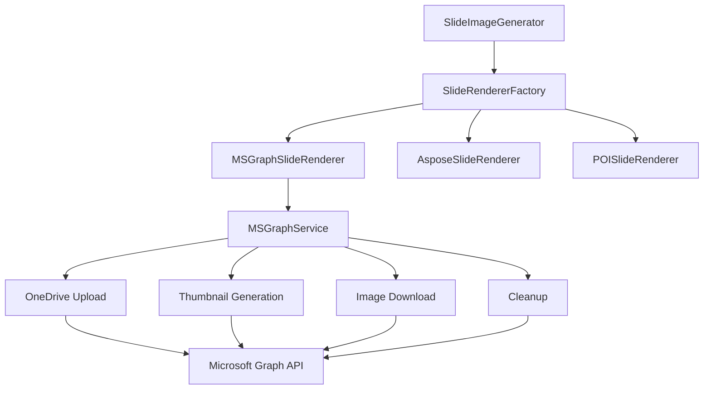
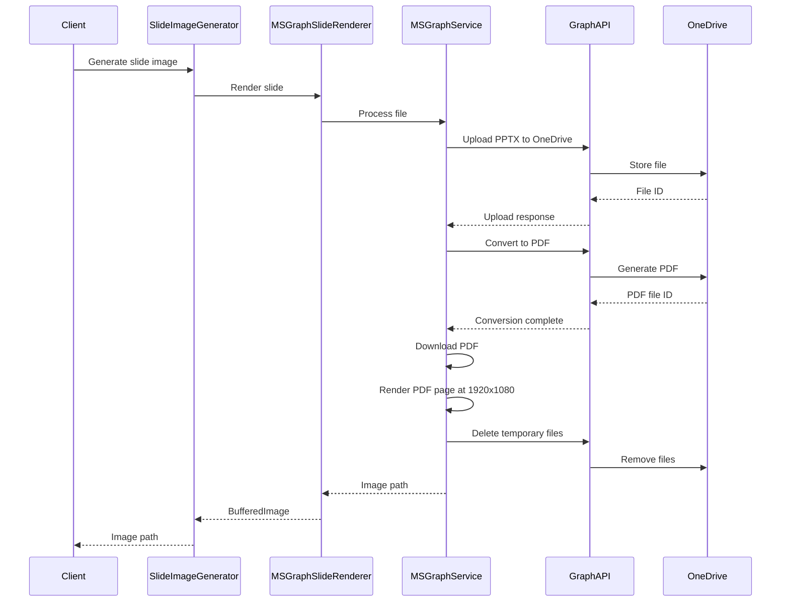
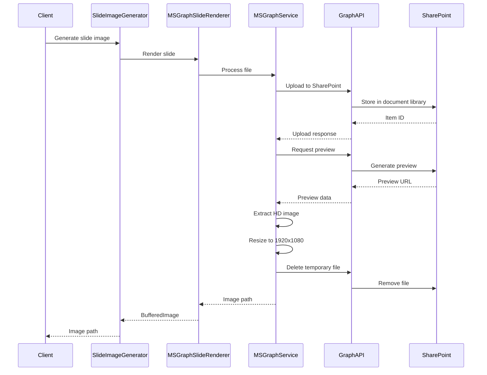

# ADR-003: Microsoft Graph API for PowerPoint Slide Rendering

## Status
Proposed

## Context
The PowerPoint to Video POC currently supports slide rendering through Apache POI and Aspose Slides. We want to add Microsoft Graph API as an additional rendering option to:
- Leverage existing Microsoft 365 infrastructure
- Achieve high-fidelity HD rendering (1920x1080px) through Microsoft's native APIs
- Avoid Aspose licensing costs
- Provide a cloud-native rendering solution

The application receives PowerPoint files through user uploads, which need to be temporarily stored in OneDrive/SharePoint to use Graph API's rendering capabilities. Standard Graph API thumbnails are limited in resolution, so we need alternative approaches for HD rendering.

## Decision
We will implement a new `MSGraphSlideRenderer` that uses two approaches for high-resolution rendering:

### Approach 1: PDF Conversion Method
1. Upload PowerPoint file to OneDrive
2. Convert PowerPoint to PDF using Graph API
3. Render PDF pages at 1920x1080px resolution
4. Clean up temporary files

### Approach 2: SharePoint Preview API Method
1. Upload PowerPoint file to SharePoint document library
2. Use SharePoint's file preview API for high-resolution rendering
3. Extract rendered images at 1920x1080px
4. Clean up temporary files

Both approaches will be evaluated and the best performing one will be the primary implementation.

## Architecture Overview

### Component Integration


### Workflow Sequence - PDF Conversion Method


### Workflow Sequence - SharePoint Preview API Method


## Implementation Details

### 1. MSGraphSlideRenderer Class
```java
package ai.bluefields.ppt2video.service.rendering.msgraph;

@Component
@Slf4j
public class MSGraphSlideRenderer implements SlideRendererStrategy {
    private final MSGraphService graphService;
    private final RenderingMetrics metrics;
    
    @Override
    public BufferedImage renderSlideFromPath(String filePath, int slideNumber, 
                                           int width, int height) {
        // 1. Upload file to OneDrive
        // 2. Generate thumbnail for specific slide
        // 3. Download thumbnail
        // 4. Convert to BufferedImage
        // 5. Clean up OneDrive file
    }
    
    @Override
    public boolean isAvailable() {
        // Check if Graph API credentials are configured
        // Verify connectivity to Graph API
    }
}
```

### 2. MSGraphService Class
```java
@Service
@Slf4j
public class MSGraphService {
    private final GraphServiceClient graphClient;
    private final String oneDriveFolderId;
    
    public String uploadToOneDrive(Path localFile);
    public byte[] generateSlideThumbnail(String fileId, int slideNumber, 
                                       int width, int height);
    public void deleteFromOneDrive(String fileId);
}
```

### 3. Configuration
```properties
# MS Graph API Configuration
app.msgraph.tenant-id=${MS_GRAPH_TENANT_ID}
app.msgraph.client-id=${MS_GRAPH_CLIENT_ID}
app.msgraph.client-secret=${MS_GRAPH_CLIENT_SECRET}
app.msgraph.onedrive-folder-id=${MS_GRAPH_ONEDRIVE_FOLDER_ID}
app.msgraph.enabled=true

# Update renderer priority to include MS Graph
app.slide-rendering.renderer-priority=MSGRAPH,ASPOSE,ENHANCED_POI,DEFAULT_POI
```

### 4. Dependencies
```xml
<dependency>
  <!-- Include the sdk as a dependency -->
  <groupId>com.microsoft.graph</groupId>
  <artifactId>microsoft-graph</artifactId>
  <!--x-release-please-start-version-->
  <version>6.48.0</version>
  <!--x-release-please-end-->
</dependency>
<dependency>
  <!-- This dependency is only needed if you are using a TokenCredential object for authentication -->
  <groupId>com.azure</groupId>
  <artifactId>azure-identity</artifactId>
  <version>1.11.0</version>
</dependency>
```

## Technical Considerations

### Authentication
- Use Client Credentials flow for server-to-server authentication
- Required permissions:
  - Files.ReadWrite.All (for OneDrive operations)
  - Sites.ReadWrite.All (if using SharePoint)

### Performance Optimization
1. **Batch Processing**: Upload once, generate all slides, then delete
2. **Caching**: Cache rendered images to avoid re-uploading
3. **Parallel Processing**: Generate multiple slide thumbnails concurrently
4. **Cleanup Strategy**: Implement scheduled cleanup for orphaned files

### Error Handling
1. **Upload Failures**: Retry with exponential backoff
2. **API Rate Limits**: Implement throttling and queue management
3. **Network Issues**: Graceful fallback to other renderers
4. **Storage Quotas**: Monitor OneDrive usage and alerts

### File Management
```
OneDrive Structure:
/PowerPoint2Video/
├── temp/
│   ├── {presentationId}/
│   │   └── presentation.pptx
│   └── cleanup.log
```

## Advantages
1. **Native Rendering**: Microsoft's own rendering engine ensures perfect fidelity
2. **HD Quality**: True 1920x1080px resolution with maximum quality
3. **No Additional Licensing**: Uses existing Microsoft 365 licenses
4. **Cloud-Native**: Aligns with cloud-first strategies
5. **Scalability**: Offloads rendering to Microsoft's infrastructure
6. **Format Flexibility**: PDF conversion preserves vector graphics

## Disadvantages
1. **Network Dependency**: Requires internet connectivity
2. **Latency**: Additional overhead for upload/conversion/download
3. **API Limits**: Subject to Graph API rate limits
4. **Storage Management**: Requires OneDrive/SharePoint storage management
5. **Complexity**: More moving parts than local rendering
6. **Multi-step Process**: Especially for PDF conversion method

## Alternatives Considered
1. **SharePoint REST API**: Less flexible than Graph API
2. **Office Online Server**: Requires on-premises deployment
3. **PowerPoint Automation API**: Not suitable for server scenarios

## Migration Strategy
1. Implement as opt-in feature with configuration flag
2. Test with subset of presentations
3. Monitor performance metrics
4. Gradually increase priority in renderer selection
5. Maintain fallback to existing renderers

## Security Considerations
1. **Credential Management**: Use secure vault for Graph API credentials
2. **Data Privacy**: Ensure temporary files are encrypted and deleted
3. **Access Control**: Limit Graph API permissions to minimum required
4. **Audit Logging**: Log all OneDrive operations
5. **Compliance**: Ensure data residency requirements are met

## Monitoring and Metrics
Track the following metrics:
- Upload/download times
- Thumbnail generation duration
- API call success rates
- Storage usage in OneDrive
- Cost per render (API calls)
- Rendering quality scores

## Future Enhancements
1. **Persistent Cache**: Store rendered slides in blob storage
2. **Webhook Integration**: Get notified when rendering completes
3. **Batch API**: Use Graph batch API for efficiency
4. **Premium Features**: Access to higher resolution options
5. **Format Options**: Support for different image formats

## Decision Outcome
Implement MS Graph API rendering as an additional option in the slide rendering pipeline, providing users with a cloud-native alternative that leverages Microsoft's native rendering capabilities while maintaining compatibility with existing renderers.

## Recommendations
1. **Start with PDF Conversion Method**: While more complex, it provides guaranteed HD quality
2. **Implement SharePoint Preview as Fallback**: Use when PDF conversion is unavailable
3. **Performance Testing**: Benchmark both methods with various presentation types
4. **Gradual Rollout**: Start with opt-in configuration before making it default

## Implementation Priority
1. Set up MS Graph authentication and basic connectivity
2. Implement PDF conversion method first (better quality guarantee)
3. Add SharePoint preview method as alternative
4. Integrate with existing renderer factory
5. Add comprehensive error handling and fallbacks
6. Performance optimization and caching